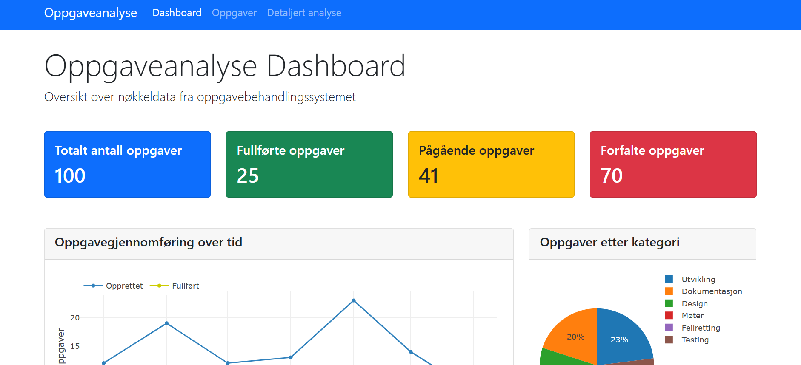

# Task Analytics Dashboard

Et dashbord for visualisering og analyse av oppgavedata. Denne applikasjonen gir deg en omfattende oversikt over oppgavegjennomføring, produktivitetstrender og ressursfordeling.



## Funksjoner

- **Oversiktsdashboard** med nøkkeltall og trendanalyse
- **Oppgaveliste** med filtrering og sortering
- **Detaljert analyse** med dyptgående diagrammer:
  - Oppgavegjennomføring over tid
  - Kategorifordeling
  - Gjennomsnittlig fullføringstid
  - Produktivitetstrender
  - Arbeidsbelastningsanalyse per person

## Teknologier

- **Backend**: Python, Flask
- **Database**: SQLite, SQLAlchemy
- **Dataanalyse**: Pandas
- **Frontend**: HTML, CSS, JavaScript
- **Visualisering**: Plotly.js
- **UI Rammeverk**: Bootstrap 5
- **Tabeller**: DataTables

## Prosjektstruktur

```
task-analytics-dashboard/
├── app.py                  # Hovedapplikasjonsfil
├── config.py               # Konfigurasjonsinnstillinger
├── requirements.txt        # Avhengigheter
├── README.md               # Denne filen
├── data/
│   ├── sample_tasks.db     # SQLite-database
│   └── seed_data.py        # Skript for å generere testdata
├── models/
│   ├── __init__.py         
│   └── task.py             # Oppgavemodell
├── services/
│   ├── __init__.py
│   └── analytics.py        # Analysetjenester
├── static/
│   ├── css/
│   │   └── main.css        # Tilpasset CSS
│   └── js/
│       └── charts.js       # Diagram-hjelpefunksjoner
└── templates/
    ├── analytics.html      # Mal for analysesiden
    ├── base.html           # Hovedmal
    ├── index.html          # Dashboardmal
    └── tasks.html          # Oppgavelistemal
```

## Installasjon

1. Klone repositoriet:
   ```
   git clone https://github.com/ditt-brukernavn/task-analytics-dashboard.git
   cd task-analytics-dashboard
   ```

2. Opprett et virtuelt miljø og aktiver det:
   ```
   python -m venv venv
   # Windows
   venv\Scripts\activate
   # macOS/Linux
   source venv/bin/activate
   ```

3. Installer avhengigheter:
   ```
   pip install -r requirements.txt
   ```

4. Start applikasjonen:
   ```
   python app.py
   ```

5. Åpne nettleseren og naviger til:
   ```
   http://127.0.0.1:5000/
   ```

## Bruk

### Dashboard
Hovedsiden viser nøkkeltall og oversiktsgrafer. Her kan du raskt se:
- Totalt antall oppgaver
- Fullførte oppgaver
- Pågående oppgaver
- Forfalte oppgaver
- Trender over tid

### Oppgaveoversikt
Oppgavesiden viser en fullstendig liste over alle oppgaver i systemet. Du kan:
- Sortere etter ulike kolonner
- Se detaljer om hver oppgave

### Detaljert analyse
Analysesiden gir dyptgående innsikt i dataene dine med avanserte diagrammer og statistikk:
- Analyser effektivitet etter kategori og prioritet
- Sammenlign estimert vs. faktisk tidsbruk
- Overvåk produktivitetstrender
- Analyser arbeidsfordelingen mellom teammedlemmer

## API-endepunkter

Applikasjonen tilbyr følgende API-endepunkter:

- `GET /api/tasks` - Henter alle oppgaver
- `GET /api/task-completion` - Oppgavegjennomføringsstatistikk
- `GET /api/category-distribution` - Kategorifordeling
- `GET /api/avg-completion-time` - Gjennomsnittlig fullføringstid
- `GET /api/productivity-trend` - Produktivitetstrender

## Framtidige forbedringer

- Brukerautentisering og autorisasjon
- Mulighet for å opprette og redigere oppgaver
- E-postvarsler for forfalte oppgaver
- Eksport av data til Excel/PDF
- Tilpasning av dashbord

